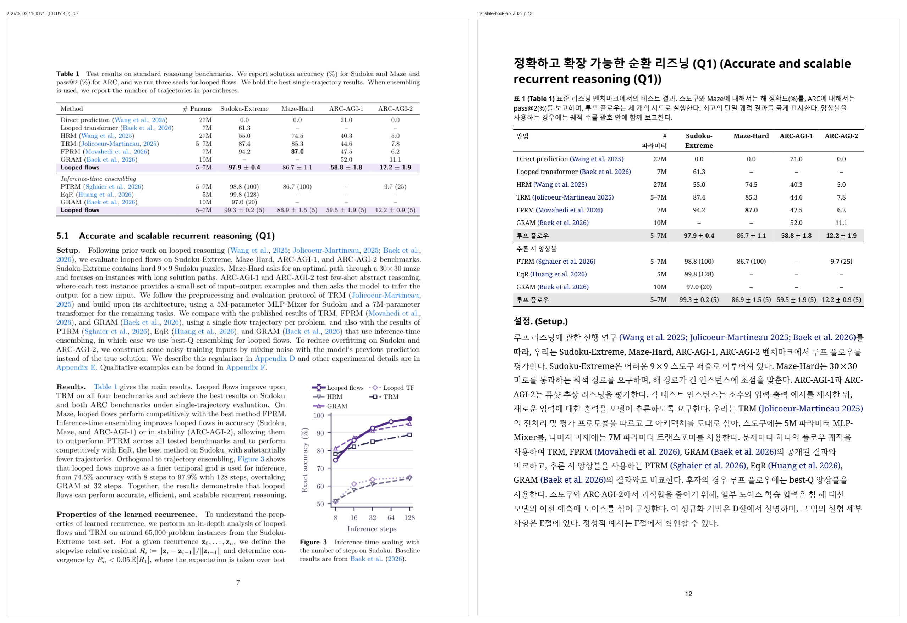
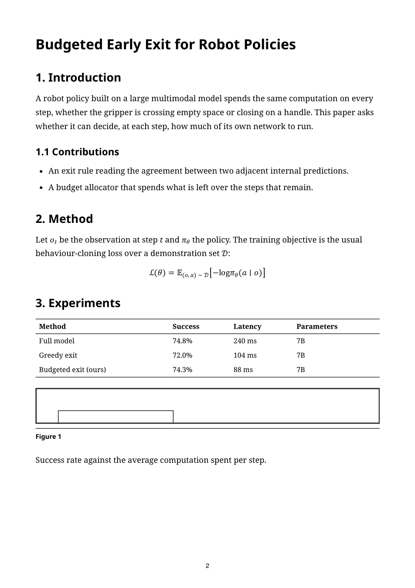
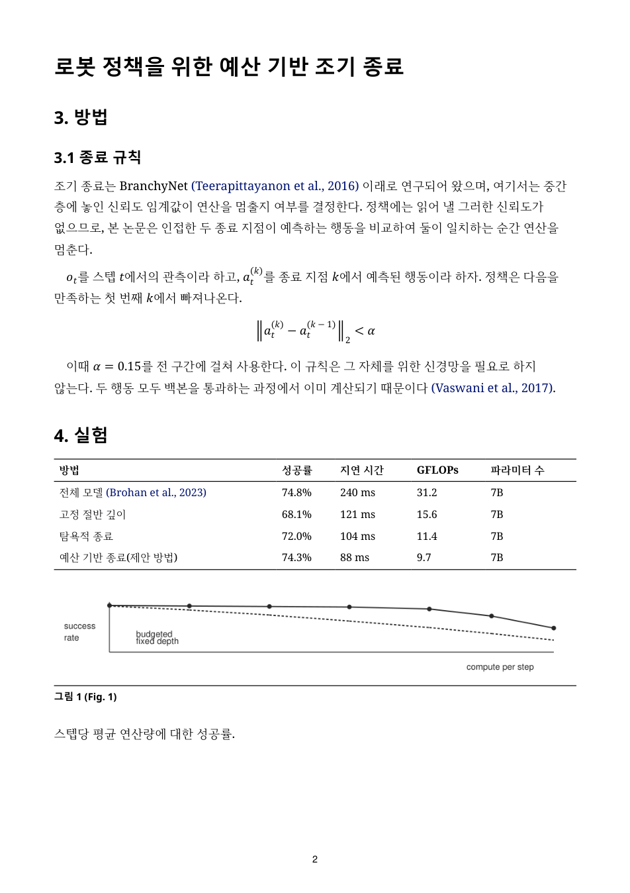
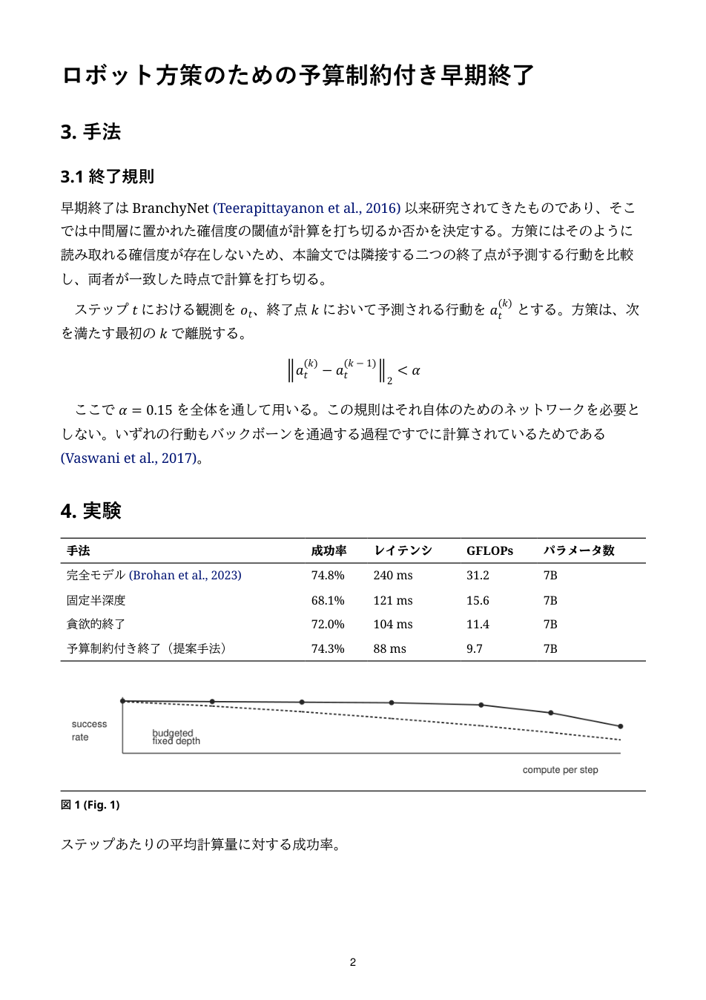
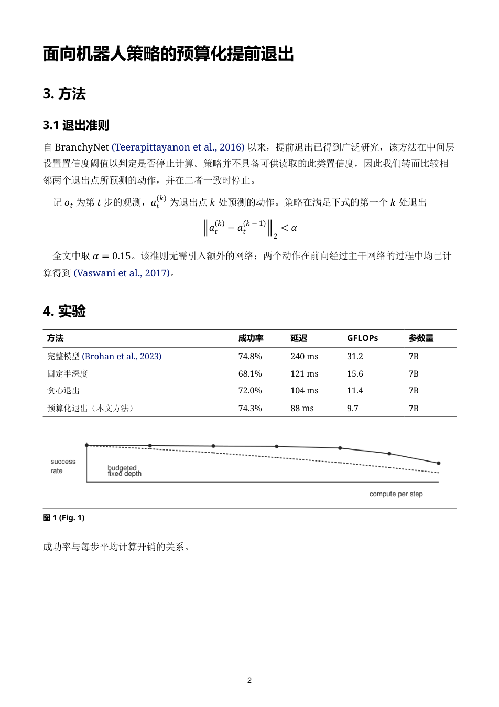
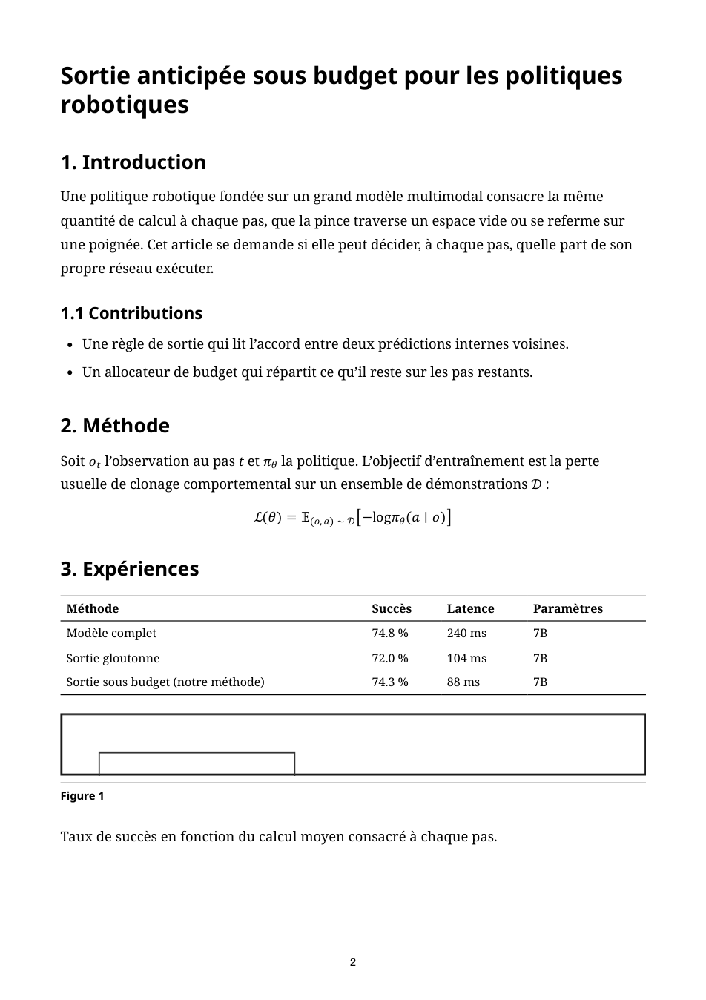
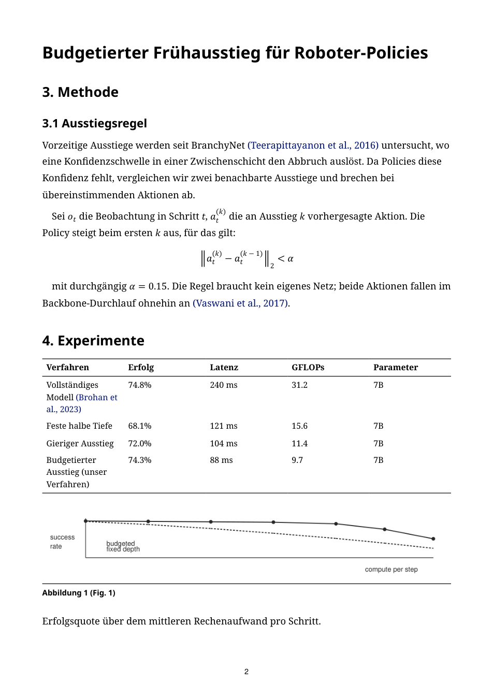
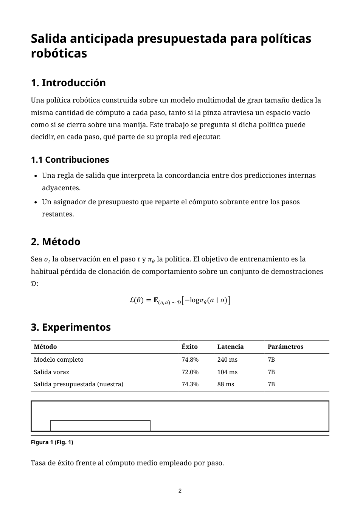

# Translate Book: arXiv

An agent skill for Claude Code, Codex and OpenClaw that turns an arXiv paper into a translated, printable book. It reads the paper's **LaTeX source**, so equations, figures, tables and the paper's own numbering carry over. PDF, DOCX and EPUB books work too, through Calibre.

[](assets/demo/03-table.png)

<sub>Left: page 7 of arXiv:2609.11801, *Thinking with Looped Flows* (CC BY 4.0). Right: page 12 of the Korean book this skill built from its LaTeX source. Every number in Table 1, and every `±`, is the paper's. **The whole book, 29 pages: [`looped-flows_ko.pdf`](https://github.com/kcy4334-lgtm/translate-book-arxiv/releases/download/v0.4.2/looped-flows_ko.pdf).** More pages, with source and licence: [assets/demo](assets/demo/README.md).</sub>

```bash
npx skills add kcy4334-lgtm/translate-book-arxiv -a claude-code -g
```

Then ask: *"translate /path/to/paper.pdf to Korean"*. The skill recognises an arXiv preprint from its first page and asks before it downloads the source. Other agents and a manual install are under [Quick Start](#quick-start).

A PDF translator only gets what a PDF reader can recover, and equations do not survive that: `pdftohtml` breaks every formula into positioned text spans, and no option puts it back together. This skill works from the LaTeX the authors wrote.

The target language is a flag: `zh`, `en`, `ja`, `ko`, `fr`, `de`, `es`, and others. The print layout is measured against Korean, and ships with Korean typography tuned.

> Forked from [deusyu/translate-book](https://github.com/deusyu/translate-book), which grew out of [claude_translater](https://github.com/wizlijun/claude_translater) and built the agent-skill workflow: sub-agents translating chunks in parallel, manifest checks, resumable runs and several output formats from one pipeline. This fork develops the arXiv LaTeX path and the logs and advisors that ship with it.

---

## How It Works

```
arXiv paper (PDF)                    │  any other book (PDF/DOCX/EPUB)
  │  detected from the page-1 stamp   │
  ▼                                   ▼
Fetch /e-print → flatten the LaTeX    Calibre ebook-convert → HTMLZ → HTML
  │  the paper's own macros resolved from the .sty files it ships
  │  equation, theorem, section and float numbers read from the source
  │  figures rasterised from the original vector PDFs, captions attached
  ▼                                   ▼
Markdown, with $...$ math intact  ←───┘
  │
  ▼
Split into chunks (chunk0001.md, chunk0002.md, ...)
  │  manifest.json tracks chunk hashes
  │  the reference list becomes its own chunk and is copied, not translated
  ▼
Parallel sub-agents (work queue, 8 in flight by default)
  │  each sub-agent: read 1 chunk → translate → write output_chunk*.md
  │  each chunk is verified, recorded and merged as it lands
  ▼
Validate (manifest hash check, 1:1 source↔output match)
  │
  ▼
Merge → Pandoc → HTML (with TOC) → Pandoc DOCX / Calibre EPUB / Chromium PDF
```

Each chunk goes to a sub-agent with a fresh context, so a long book never fills one session and nothing gets cut off at the end.

## What it prints

The same page in each language: numbered sections, a display equation, citations, a results table and a figure. Click any page for the full-size render.

| | | | |
|:--:|:--:|:--:|:--:|
| [](docs/samples/sample_en.png) | [](docs/samples/sample_ko.png) | [](docs/samples/sample_ja.png) | [](docs/samples/sample_zh.png) |
| English (source) | 한국어 | 日本語 | 简体中文 |
| [](docs/samples/sample_fr.png) | [](docs/samples/sample_de.png) | [](docs/samples/sample_es.png) | |
| Français | Deutsch | Español | |

The float label follows the language (`Figure 1`, `그림 1 (Fig. 1)`, `図 1`). Table headers and method names are translated; numbers, units and citations are not. The body font is chosen per script, and line breaking follows each language's rules.

This page was written for the repository, with made-up results, so it can be shown in seven languages without depending on any paper's licence. Its source is `tests/fixtures/sample_page.md` with one translation per language beside it, and `python tests/sample_pages.py` renders every image again with the shipped `a4-book` profile.

## Features

- **Numbers come from the paper**: equation, theorem, section, float and subfigure numbers are read from the LaTeX source and checked against the original PDF by `tests/source_probe.py`
- **The paper's own macros are resolved**: a paper's `.sty` is never `\input`, so pandoc would print `\ie` or `\parhead` as they are. `scripts/paper_macros.py` expands the definitions the paper ships: 4,099 calls across 21 papers, with nothing lost but the macro names on the six papers diffed word by word. When it cannot expand one safely it refuses and names the macro and the reason
- **The reference list is copied as is**: it becomes its own chunk, usually the largest, at 27–34% of a paper's characters
- **Parallel sub-agents**: a work queue keeps 8 translators running, each with its own context; the next chunk starts as soon as a slot frees
- **Every chunk is checked before it counts**: `scripts/verify_chunk.py` compares each output with its source, the glossary it was given and the chunk it quoted
- **Consistent terms**: a glossary built before translation, a per-chunk term table, and short read-only excerpts from the neighbouring chunks for names and pronouns
- **Resumable**: SHA-256 hashes in a manifest keep stale outputs out of the merge, and a changed glossary re-translates only the chunks that used the changed terms
- **Print-ready PDF**: headless Chromium against a real `@page` box (A4, 18/18/22/18 mm, 11.5 pt), page numbers stamped afterwards because Chrome has no margin boxes. `scripts/layout.py` holds the page geometry and fonts
- **Output**: HTML with a floating TOC, DOCX, EPUB and PDF, with an optional EPUB cover, working folder and export name
- **Tests**: 2,263, standard library only, run in CI

## Growing the skill

Each paper brings LaTeX constructs the last one did not have. Four stores ship with the skill so a construct met once is handled the next time:

| | what it holds |
|---|---|
| `KNOWLEDGE.md` | What a tool actually did, with the measurement that proved it. 217 entries |
| `KNOWHOW.md` | What a way of working cost, so it is not paid twice. 44 entries |
| `REFEREE.md` | Whether a repeated failure belongs to a tool, a briefing or a role. 6 entries |
| `corpus/shapes.json` | Every LaTeX construct each paper carried, written by the build itself. 28 papers |

The census answers *"has this ever been seen?"* with a count, and lists what has never been seen, so a pattern that has never met a real example is not trusted. `tests/test_source_lint.py` fails when the corpus has met a construct nobody has classified, so a new construct is dealt with before release.

Four advisor sub-agents read the stores:

- **old-man**: before concluding a paper does not contain something, or writing a pattern whose match decides it; names the spellings and layouts the pattern would miss
- **question-monster**: after concluding something is impossible; hands back candidates to test
- **fast-finder**: instead of reading the logs; returns the few entries that bear on the question
- **referee**: once a whole run is gated; tells a tool fault from a briefing fault from a role's

### An example

From one working session:

1. `\ie` was printing mid-sentence in a finished Korean book, five times, where the paper's PDF prints "i.e." five times.
2. Fixed by resolving the paper's macros from the `.sty` it ships (`scripts/paper_macros.py`).
3. **old-man**, asked what that fix would miss, found two more: a display opened by a macro (`\newcommand{\be}{\begin{equation}}`), which a regex looking for `\begin` cannot see, and a name bound to `\hspace` that looks like an abbreviation; expanding it would have deleted a listing's indentation.
4. **question-monster** found a third: an odd `$` inside an `\ifmmode` body broke `$` pairing for the rest of one paper, and 73 rewrites were landing inside its formulas.
5. All three were fixed and recorded, and the census now counts their shapes, so the next paper with one fails a test instead of reaching a reader.

## Prerequisites

Setting up on a new machine? [INSTALL.md](INSTALL.md) walks through placement and verification.

Run `python scripts/doctor.py --strict` first. It reports what is installed and what is missing, using the same lookups as the pipeline, and exits non-zero when something required is absent.

- **Agent runtime**: Claude Code, Codex or OpenClaw
- **Python 3.8+**
- **Pandoc**: every Markdown and HTML conversion goes through it ([download](https://pandoc.org/))
- **Chromium, Chrome or Edge**: prints the PDF. Set `TRANSLATE_BOOK_CHROME` if yours is somewhere the finder does not look
- **Calibre**: `ebook-convert`, for EPUB and for PDF/DOCX/EPUB input ([download](https://calibre-ebook.com/))
- **PyMuPDF** (`pip install pymupdf`): stamps page numbers, and every probe that reads a PDF needs it
- **pypandoc** (`pip install pypandoc`): used by the conversion path
- **beautifulsoup4**: optional, for a better table of contents

**Fonts decide whether you get the same pages.** A missing font falls back to one with different metrics, the lines break elsewhere, and the page count changes.

| target | install |
|---|---|
| Korean body and headings | Noto Serif KR, Noto Sans KR ([Google Fonts](https://fonts.google.com/noto)) |
| formulas | a font with an OpenType MATH table: Cambria Math ships with Office; [STIX Two Math](https://www.stixfonts.org/) is free |

To check that a machine produces the same output, build a real PDF and measure it:

```bash
python tests/layout_probe.py --strict
python -m unittest discover -s tests -p "test_*.py"
```

## What it runs, fetches and writes

Everything the skill does outside your agent's own conversation:

- **Fetches** one thing over the network: an arXiv paper's LaTeX source,
  `https://arxiv.org/e-print/<id>`, and only after asking you. The request
  carries the user agent `translate-book/1.0` and nothing about you; the
  download is cached in the working folder, so a resumed run does not fetch
  it again. Nothing else is downloaded.
- **Sends** nothing. There is no telemetry and no upload. The translation is
  done by your agent's own model, in its own sub-agents.
- **Runs** its bundled Python scripts, Pandoc, Calibre's `ebook-convert`, and
  a headless Chromium, Chrome or Edge to print the PDF.
- **Writes** its working files and the finished book into `<book>_temp/`, in
  the current directory or under the `temp_root` you name. When a run teaches
  it something, it appends to its own logs inside the skill folder
  (`KNOWLEDGE.md`, `KNOWHOW.md`, `REFEREE.md`, `referee/runs.json`,
  `corpus/shapes.json`), and it records which advisors were consulted in
  `advisors/consults.jsonl` there.
  `scripts/install_advisors.py` copies the four advisor definitions to
  `~/.claude/agents/`, and only when you run it yourself.

## Quick Start

### 1. Install

| agent | with the `skills` CLI | by hand |
|---|---|---|
| Claude Code | `npx skills add kcy4334-lgtm/translate-book-arxiv -a claude-code -g` | `git clone https://github.com/kcy4334-lgtm/translate-book-arxiv.git ~/.claude/skills/translate-book` |
| Codex | `npx skills add kcy4334-lgtm/translate-book-arxiv -a codex -g` | `git clone https://github.com/kcy4334-lgtm/translate-book-arxiv.git ~/.agents/skills/translate-book` |
| OpenClaw | `npx skills add kcy4334-lgtm/translate-book-arxiv -a openclaw -g` | `git clone https://github.com/kcy4334-lgtm/translate-book-arxiv.git ~/.openclaw/skills/translate-book` |

Restart the agent if the skill does not appear.

### 2. Translate

Ask the agent:

```text
translate /path/to/paper.pdf to Japanese
```

In Claude Code you can also type `/translate-book translate /path/to/paper.pdf to Japanese`, and in Codex `$translate-book Translate /path/to/paper.pdf into Japanese.` The skill runs the whole pipeline: convert, chunk, translate in parallel, validate, merge and build every format.

### 3. Find the outputs

Everything is in `{book_name}_temp/`:

| File | Description |
|------|-------------|
| `output.md` | Merged translated Markdown |
| `book.html` | Web version with a floating TOC |
| `book.docx` | Word document |
| `book.epub` | E-book |
| `book.pdf` | Print-ready PDF |

## Verifying a build

Defects in this pipeline usually show up as missing content, with no error message. Each check below compares a built `<name>_temp` directory with something the build did not produce itself; add `--strict` to exit non-zero.

| command | what it compares |
|---|---|
| `python scripts/doctor.py --strict` | this machine against what the pipeline needs; run it first |
| `python scripts/verify_chunk.py <temp_dir> --lang ko --strict` | each sub-agent's output against its source chunk, the glossary it was given, and the chunk it quoted |
| `python scripts/verify_tables.py snapshot <temp_dir>` … `check <temp_dir> --strict` | a table before and after its captions were translated: numbers, rows, cells and spans must be unchanged |
| `python tests/table_probe.py <temp_dir> --strict` | every built table against the `tabular` it came from: column count, row count, spans, printed values, stranded row labels |
| `python tests/inventory_probe.py <temp_dir> --lang ko --strict` | what the source contains against what reached the page, so a whole kind of content missing still shows |
| `python tests/leak_probe.py <temp_dir> --strict` | the page against what a sentence is made of: every token carrying markup syntax; a token the source spells with a LaTeX escape (`R\&D`) counts as a word |
| `python tests/source_probe.py <temp_dir> --strict` | the finished book against the original PDF |
| `python tests/format_probe.py <temp_dir> --lang ko --strict` | DOCX against the ebook HTML; where they disagree is the finding |
| `python tests/consistency_probe.py <temp_dir> --lang ko --strict` | the book against itself: visible LaTeX, empty formulas, term drift, first-use English glosses |
| `python tests/layout_probe.py --strict` | a real PDF it builds and measures: page size, margins, type size, embedded fonts |
| `python tests/dry_run.py <temp_dir> --lang ko` | the whole pipeline on a real paper with no API call, before translating |

## Troubleshooting

| Problem | Solution |
|---------|----------|
| `Calibre ebook-convert not found` | Install Calibre and put `ebook-convert` on PATH |
| PDF generation fails | Install Chromium, Chrome or Edge, or set `TRANSLATE_BOOK_CHROME` to its path; `doctor.py` shows which browser it found. `merge_and_build.py --pdf-engine calibre` is the older route, which ignores the print layout |
| `Manifest validation failed` | Source chunks changed since splitting; re-run `convert.py` |
| `was created from different source bytes` | The temp dir belongs to a different source file; delete it or use a fresh `--temp-root` |
| `Blank output` / `Empty output` | A sub-agent wrote an empty chunk; re-run the skill to re-translate it |
| `Missing source chunk` | A source chunk was deleted; re-run `convert.py` |
| Incomplete translation | Re-run the skill; it resumes where it stopped |
| Changed title, template or assets but the output did not update | Delete `output.md`, `book*.html`, `book.docx`, `book.epub`, `book.pdf` from the temp dir and re-run `merge_and_build.py` |
| Page-number lines left in text from a PDF | Sequences like `1, 2, 3` are dropped automatically and years or chapter numbers are kept. If that misses your case, delete the cached `input.md` and `chunk*.md` and run `convert.py --strip-page-numbers`, which drops every line that is only digits |
| `output.md exists but manifest invalid` | Stale output; the script deletes it and merges again |
| `Glossary upgrade rejected: duplicate source` | Two terms share a source or alias; rename one in `glossary.json` (for example `Apple` to `Apple (Inc.)`) and reload |

## Pipeline Details

### Step 1: Convert

```bash
python3 scripts/convert.py /path/to/paper.pdf --olang ko --allow-network
```

For an arXiv preprint, detected from the stamp on page 1, `--allow-network` lets the script download the LaTeX source; the skill asks you before passing it. `--backend arxiv` or `--arxiv-id <id>` chooses this path explicitly. The source is flattened, the paper's macros resolved, figures rasterised from the original files, and pandoc turns the result into Markdown with the math intact. Without `--allow-network`, and for every other book, Calibre converts the input to HTMLZ, which becomes Markdown.

Either way the Markdown is split into chunks of about 6,000 characters. `manifest.json` records the SHA-256 of each source chunk, and `source_fingerprint.json` ties the temp dir to the exact source file, so running against a replaced file stops instead of reusing old chunks.

The working directory is `{book_name}_temp/` under the current directory; `--temp-root /path/to/work` puts it under another parent.

### Step 1.5: Glossary

Each chunk is translated by a fresh sub-agent, so a name could come out differently in different chunks. A glossary built before translation prevents that:

1. Sample 5 chunks (first, last and three evenly spaced).
2. Extract proper nouns and recurring terms, and pick one translation for each.
3. Write `<temp_dir>/glossary.json` (schema below; it can be edited by hand).
4. `python3 scripts/glossary.py count-frequencies <temp_dir>` fills in how often each term occurs. ASCII terms match on word boundaries, so `cat` does not match `category`; CJK terms match as substrings; single-character CJK terms are rejected; aliases count toward their term.
5. For each chunk, `python3 scripts/glossary.py print-terms-for-chunk <temp_dir> chunkNNNN.md` prints a table of the terms that appear in it plus the most frequent ones in the book, and that table goes into the chunk's prompt as a hard constraint.

```json
{
  "version": 2,
  "terms": [
    {"id": "Manhattan", "source": "Manhattan", "target": "曼哈顿",
     "category": "place", "aliases": [], "gender": "unknown",
     "confidence": "medium", "frequency": 12,
     "evidence_refs": [], "notes": ""}
  ],
  "high_frequency_top_n": 20,
  "applied_meta_hashes": {}
}
```

An existing `glossary.json` is never overwritten; edit it between runs, or delete it to rebuild. Version 1 files are upgraded on first load, and the upgrade stops with a message if two terms share a source. `scripts/run_state.py` records which terms each chunk used, so a later glossary edit re-translates only the chunks it affects.

### Step 2: Translate

Sub-agents run as a work queue, 8 at a time by default. Each one reads one chunk (for example `chunk0042.md`), translates it with its term table and the short excerpts from the chunks around it, and writes `output_chunk0042.md` plus `output_chunk0042.meta.json`, its notes for the glossary.

As each chunk lands it is verified (`verify_chunk.py`), recorded, and its notes merged, in that order. The reference-list chunk is written by `convert.py` and never sent to a sub-agent.

Before starting, `scripts/run_state.py plan <temp_dir>` decides which chunks need translating, which only need recording, and which are unchanged. A re-run skips chunks that already have valid output, and a failed chunk is retried once. `--retranslate-untracked` forces old outputs through the current glossary when adopting an older temp dir.

### Step 3: Merge and build

```bash
python3 scripts/merge_and_build.py --temp-dir paper_temp --title "translated title"
```

`--cover cover.jpg` gives the EPUB a cover, and `--export-name <stem>` adds copies such as `<stem>.epub` next to the standard `book.*` files.

Before merging, the script checks that every source chunk has an output, that the source hashes still match the manifest, and that no output is empty; an empty chunk stops the merge. Then it merges, converts to HTML with Pandoc and adds the TOC, and builds DOCX with Pandoc, EPUB with Calibre and the PDF with headless Chromium. `--docx-engine calibre` and `--pdf-engine calibre` switch to the older Calibre routes, which drop the math in DOCX and ignore the print layout in PDF.

A temp dir belongs to one run. After changing the title, author, language, template or images, use a fresh temp dir or delete the built files listed under Troubleshooting first.

## Project Structure

| File | Purpose |
|------|---------|
| `SKILL.md` | The skill definition the agent follows |
| `KNOWLEDGE.md`, `KNOWHOW.md`, `REFEREE.md` | The logs described under [Growing the skill](#growing-the-skill) |
| `.claude/agents/` | The four advisors: `old-man.md`, `question-monster.md`, `fast-finder.md`, `referee.md` |
| `scripts/convert.py` | PDF/DOCX/EPUB to Markdown chunks |
| `scripts/backends.py` | Chooses the calibre or arXiv path and records which one built the temp dir |
| `scripts/arxiv_backend.py` | The arXiv path: fetch, flatten, convert with pandoc, figures from the originals |
| `scripts/paper_macros.py` | Expands the paper's own macros from the `.sty` files it ships |
| `scripts/pdf_text.py` | Reads a PDF in reading order and scores how many of the paper's sentences survived |
| `scripts/algorithm_float.py` | Turns `algorithm` floats into Markdown lists |
| `scripts/latex_rows.py` | Finds the `\\` that really ends a table row |
| `scripts/grid_table.py` | Grid tables for layouts pandoc cannot write; not wired into the pipeline |
| `scripts/math_guard.py` | Replaces formulas and citations with placeholders (`⟦M0042⟧`) during translation and restores them |
| `scripts/sidecar_edit.py` | Reads and writes a chunk's formula sidecar file without breaking it |
| `scripts/manifest.py` | Chunk hashes and merge validation |
| `scripts/glossary.py` | Glossary and per-chunk term tables |
| `scripts/chunk_context.py` | Excerpts from the neighbouring chunks for each prompt |
| `scripts/meta.py` | Schema of the per-chunk notes file (`output_chunkNNNN.meta.json`) |
| `scripts/merge_meta.py` | Merges those notes into the glossary as chunks land |
| `scripts/run_state.py` | Plans and records selective re-translation |
| `scripts/verify_chunk.py` | Checks each sub-agent's output before it counts |
| `scripts/verify_tables.py` | Checks that table numbers and structure survive translation |
| `scripts/table_language.py` | The common table header words that must be translated |
| `scripts/repair.py` | Repairs an already translated book in place |
| `scripts/merge_and_build.py` | Merge, then HTML, DOCX, EPUB and PDF |
| `scripts/layout.py` | Fonts per language and print profiles (page size, margins, type size) |
| `scripts/chromium_pdf.py` | Prints the PDF with headless Chromium: page numbers, TOC page numbers, bookmarks |
| `scripts/equation_fit.py` | Re-renders when a wide equation prints under its own number |
| `scripts/calibre_html_publish.py` | Calibre wrapper for EPUB, and for DOCX or PDF with `--docx-engine calibre` or `--pdf-engine calibre` |
| `scripts/template.html`, `scripts/template_ebook.html` | HTML templates for the web and ebook outputs |
| `scripts/doctor.py` | Checks that this machine can build the same book |
| `scripts/kb.py` | Searches KNOWLEDGE, KNOWHOW and REFEREE: `find`, `list`, `show`, `check`, `stale` |
| `scripts/corpus_census.py` | The census of LaTeX constructs per paper; `digest` shows frequencies and what has never been seen |
| `scripts/referee.py` | `tally`, `record`, `history`: failures across chunks and books |
| `scripts/advisors.py` | Records which advisor was consulted, on what, and what it said |
| `scripts/install_advisors.py` | Copies the advisor definitions to `~/.claude/agents/` |
| `corpus/shapes.json`, `referee/runs.json` | The census and the referee's run history |
| `tests/` | The test suite, the probes listed under [Verifying a build](#verifying-a-build), and baseline books in `tests/baselines/` |

## Development

### Test assets

Baseline inputs live in `tests/baselines/<book-id>/`. Full-pipeline outputs go to `tests/.artifacts/`, which is not committed; run from inside it so `{book_name}_temp/` lands there and not in the repository root:

```bash
mkdir -p tests/.artifacts && cd tests/.artifacts
python3 ../../scripts/convert.py ../baselines/standard-alice/standard-alice.epub --olang zh
# translate with the skill, then:
python3 ../../scripts/merge_and_build.py --temp-dir standard-alice_temp --title "test"
```

### Releases

Versions are git tags on `main`. The tag is the only version anchor; no file holds a version string.

```bash
python -m unittest discover -s tests -p "test_*.py"    # green first
git push origin main
git tag vX.Y.Z && git push --tags
python tools/build_plugin_branch.py && git push origin claude-plugin
```

`/release` in `.claude/commands/release.md` runs the last three lines and stops at the first failure. A tag already on the remote is not moved without asking, because someone may have fetched it.

The last line refreshes the `claude-plugin` branch, which Anthropic's plugin directory follows instead of `main`. The directory refuses any file over 5 MiB and holds binaries for review, while `main` keeps the test books the suite needs, so the branch is built from the tag with only the files the skill runs on plus `.claude-plugin/plugin.json`.

This fork is not published on ClawHub. The upstream project publishes there as `translate-book`, and that name is theirs.

A translated book is attached to a release only when the paper's licence allows it. `looped-flows_ko.pdf` on v0.4.2 comes from a CC BY 4.0 paper. A paper under arXiv's default licence does not allow redistributing a translation, and arXiv states which licence applies in the `<license>` field of its OAI-PMH record (the Atom API has no licence field).

### Contributing

Please open an issue rather than a pull request. A change has to be checked against the rules in `SKILL.md`, the chunk and manifest contracts, the baseline assets and the release flow together. If you have a patch, put the idea, the key diff, a failing case or your verification notes in the issue; a pull request may be closed in favour of one.

A useful issue includes:

- current and expected behaviour
- input format and environment: PDF/DOCX/EPUB, OS, Python, Calibre and Pandoc versions
- minimal steps to reproduce, with a small public-domain sample if possible
- logs, screenshots or the generated file names that show the failure

## Roadmap

The upstream project's plan for name and term consistency ([issue #7](https://github.com/deusyu/translate-book/issues/7)) has shipped in three phases: glossary feedback from sub-agents, neighbouring-chunk context for pronouns, and selective re-translation. A fourth, warming up the glossary before the first chunks run, is open until real books show it is needed.

## Star History

[](https://star-history.com/#kcy4334-lgtm/translate-book-arxiv&Date)

## License

[MIT](LICENSE)
